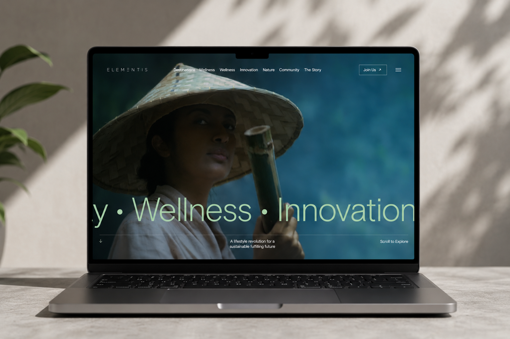

# 🌿 Elementis — Premium Digital Experience

[](https://nextjs.org/)
[](https://react.dev/)
[](https://tailwindcss.com/)
[](https://motion.dev/)
[](LICENSE)

> **Elementis** is an Awwwards-inspired interactive digital experience crafted with precision, blending high-end aesthetics with cutting-edge web technologies. Reimagining modern web design, it integrates fluid layouts, smooth scrolling, and cinematic animations.

---

## 🖼️ Preview

<div align="center">
  
</div>

---

## ✨ Key Features

- **Fluid Responsive Layouts**: Custom viewport-based scaling system ensuring crisp, consistent layout ratios across all display sizes.
- **Immersive Smooth Scroll**: Integrated with **Lenis** for a luxurious, weighted momentum scrolling experience.
- **Cinematic Motion & Micro-interactions**: Powered by **Motion (Framer Motion)** for scroll-driven reveals, hover states, and smooth UI transitions.
- **Comprehensive UI Sections**:
  - 📽️ **Hero**: High-impact entrance with interactive controls and dynamic visual layers.
  - 📖 **Introduction**: Atmospheric brand message introducing the core design vision.
  - 🧘 **Wellness Sanctuary**: Rich interactive visual showcase with curated photography.
  - 💎 **Innovation**: Interactive feature modules with interactive card reveals.
  - 📜 **Elementis Story**: Engaging brand narrative and interactive story panels.
  - 🍃 **Sustainable Retreat**: Parallax-enhanced storytelling centered around eco-conscious architecture.
  - ✉️ **Interactive Contact Form & Footer**: Custom input design and navigation.
- **Mobile-Optimized & Touch Ready**: Custom mobile side menu, touch-friendly interactions, and responsive navigation bar.
- **Performance-Focused**: Built on Next.js 15 App Router with TypeScript and React 19.

---

## 🛠️ Technical Stack

- **Framework**: [Next.js 15 (App Router)](https://nextjs.org/)
- **Library**: [React 19](https://react.dev/)
- **Styling**: [Tailwind CSS 4](https://tailwindcss.com/)
- **Animations**: [Motion (Framer Motion 12)](https://motion.dev/)
- **Smooth Scroll**: [Lenis](https://lenis.darkroom.engineering/)
- **Language**: [TypeScript](https://www.typescriptlang.org/)

---

## 🚀 Getting Started

### Prerequisites

- Node.js 18.x or later
- npm / pnpm / yarn

### Installation

1. **Clone the repository:**
   ```bash
   git clone https://github.com/kolikrish/Elementis-Clone.git
   cd Elementis-Clone
   ```

2. **Install dependencies:**
   ```bash
   npm install
   ```

3. **Run the development server:**
   ```bash
   npm run dev
   ```

4. **Open the application:**
   Navigate to [http://localhost:3000](http://localhost:3000) to view the application in your browser.

---

## 📂 Project Structure

```text
├── app/                  # Next.js App Router (Pages, Layouts, Providers)
├── components/           # Reusable UI components (NavBar, SideBar, Buttons, etc.)
├── sections/             # Core page sections (Hero, WellnessSanctuary, Innovation, etc.)
├── public/               # Static assets & preview images (preview.png, images, icons)
├── hooks/                # Custom React hooks (useLenis, useViewport, etc.)
├── utils/                # Helper functions and utilities
└── package.json          # Project configuration & dependencies
```

---

## 🎨 Design Philosophy

Elementis is built around **"Invisible Design"**—where smooth animations, precise viewport math, and typography work together seamlessly to keep the focus purely on the visual content and user experience.

---

<div align="center">
  <p>Crafted with ❤️ for modern digital experiences</p>
</div>
